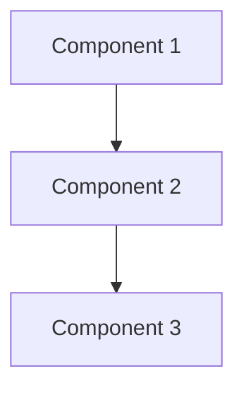
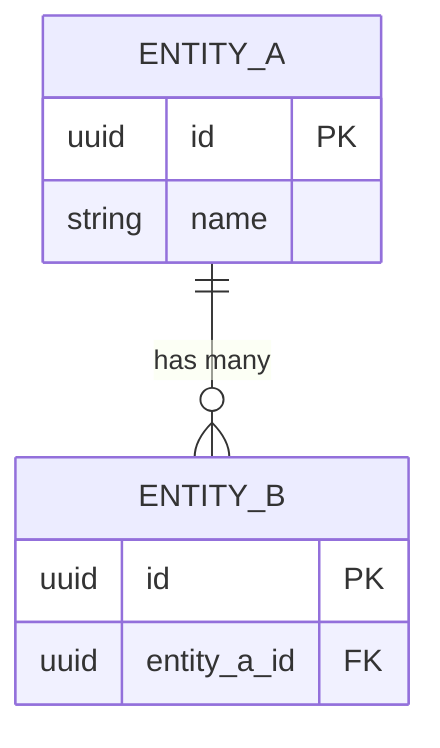

# Specification: [Project/Feature Name]

**Version:** [Semantic version, e.g. 1.0.0]
**Date:** [ISO 8601, e.g. 2026-04-10]
**Status:** Draft | In Review | Approved
**Owner:** [Name/Team]

The `name` in the YAML frontmatter is the stable identifier used when this file is archived (renamed to `docs/specs/{name}.md`) after a new active spec replaces `docs/specs/spec.md`. Use kebab-case and keep it unique among archived specs in that folder.

> This specification is the **contract** between requirements and implementation.
> Every requirement maps to acceptance criteria. Every acceptance criterion maps to a test.
> If it's not in the spec, it doesn't get built. If it can't be tested, it's not a requirement.

---

## 1. Context

### 1.1 Problem Statement

[What problem or user need does this solve? What pain point are we addressing?]

### 1.2 Background

[Relevant technical, business, or organizational context that shapes the solution.]

### 1.3 Business Value

[Why are we building this? What's the expected impact? Include metrics where possible.]

### 1.4 User Stories

```
As a [user role],
I want to [action/capability],
So that [expected benefit].
```

[Add as many user stories as needed to capture the full scope of user needs.]

---

## 2. Scope

### 2.1 In Scope

- [Capability or deliverable 1]
- [Capability or deliverable 2]

### 2.2 Out of Scope (Non-Goals)

Explicitly document what is NOT included to prevent scope creep.

- [Explicitly excluded capability 1]
- [Explicitly excluded capability 2]

---

## 3. Requirements

### 3.1 Functional Requirements

Each requirement MUST have testable acceptance criteria.

| ID | Requirement | Acceptance Criteria | Priority |
|----|-------------|---------------------|----------|
| FR-1 | [Requirement name] | [Specific, measurable criterion] | Must Have |
| FR-2 | [Requirement name] | [Specific, measurable criterion] | Must Have |
| FR-3 | [Requirement name] | [Specific, measurable criterion] | Should Have |

### 3.2 Non-Functional Requirements

- **Performance:**
  - Response time: < [X]ms (p95)
  - Throughput: [X] requests/second
  - Concurrent users: [X]
- **Security:**
  - Authentication: [method, e.g. JWT, OAuth2]
  - Authorization: [model, e.g. RBAC, ABAC]
  - Encryption: [TLS version, at-rest encryption]
  - Input validation: All user inputs validated and sanitized
  - Secrets: No secrets in code; use [env vars / secret manager]
- **Reliability:**
  - Uptime target: [e.g. 99.9%]
  - Recovery time objective: [X minutes]
  - Data backup: [strategy]
- **Maintainability:**
  - Test coverage: >= [X]%
  - All public functions/classes documented
  - Linting: [linter] with [config]
  - Type safety: [type hints / TypeScript strict mode / etc.]

---

## 4. Behavior Specification

Define how the system behaves in concrete scenarios. These become your tests.

### 4.1 Success Scenarios

#### Scenario: [Name]

```
Given: [precondition]
When:  [action]
Then:  [expected result]
And:   [additional assertions]
```

#### Scenario: [Name]

```
Given: [precondition]
When:  [action]
Then:  [expected result]
```

### 4.2 Edge Cases & Error Scenarios

| Input / Condition | Expected Behavior | Test Case |
|-------------------|-------------------|-----------|
| [edge case 1] | [expected behavior] | `test_[description]()` |
| [edge case 2] | [expected behavior] | `test_[description]()` |
| [malicious input] | [reject / sanitize safely] | `test_[description]()` |

---

## 5. Technical Stack

All components MUST specify versions. Prefer latest stable.

| Component | Technology | Version |
|-----------|-----------|---------|
| Language | [e.g. Python] | [e.g. 3.12] |
| Framework | [e.g. FastAPI] | [e.g. 0.115] |
| Database | [e.g. PostgreSQL] | [e.g. 16] |
| Infrastructure | [e.g. AWS / Azure / GCP] | [region] |
| Key dependencies | [list critical libs] | [versions] |

---

## 6. Architecture

### 6.1 Overview

[High-level description of the architecture and the reasoning behind it.]

### 6.2 Components

| Component | Responsibility |
|-----------|---------------|
| [Component 1] | [What it does] |
| [Component 2] | [What it does] |

### 6.3 Component Diagram



### 6.4 Data Flow

[Describe how data moves through the system for key operations.]

### 6.5 Key Decisions (ADRs)

Document significant architecture choices:

| Decision | Rationale | Alternatives Considered |
|----------|-----------|------------------------|
| [e.g. Use PostgreSQL over MongoDB] | [Why this choice] | [What else was considered] |

---

## 7. Data Model

### 7.1 Entities

For each entity:

#### [EntityName]

| Field | Type | Constraints | Default | Description |
|-------|------|-------------|---------|-------------|
| id | [type] | PRIMARY KEY, NOT NULL | auto | [description] |
| [field] | [type] | [constraints] | [default] | [description] |

**Relationships:** [One-to-Many with X, Many-to-Many with Y]
**Indexes:** [field(s) — purpose]
**Validation Rules:** [Business rules that constrain this entity]

### 7.2 Entity Relationship Diagram



---

## 8. Interface Contract

### 8.1 Interface Type

Check all that apply:

- [ ] REST API
- [ ] GraphQL API
- [ ] Web Application (Frontend)
- [ ] CLI (Command Line Interface)
- [ ] Library / SDK
- [ ] Mobile Application
- [ ] Other: [specify]

### 8.2 Interface Specifications

**For each interface, specify:**
- Name / path / signature
- Input schema (types, constraints, validation)
- Output schema (success response format)
- Error responses (codes, format — see Section 9)
- Authentication / authorization requirements

#### REST API Endpoints

> Include this section if the project exposes HTTP APIs.

**Base URL:** [e.g. `https://api.example.com/v1`]
**Authentication:** [method]
**Content-Type:** `application/json`

##### [METHOD] /api/v1/[resource]

- **Description:** [What this endpoint does]
- **Auth:** [Required / Public]
- **Request:**
  ```json
  {
    "field": "type — constraints"
  }
  ```
- **Success Response (200):**
  ```json
  {
    "data": {},
    "meta": {}
  }
  ```
- **Error Responses:** [See Section 9 for format]

#### CLI Commands

> Include this section if the project is a CLI tool.

##### `command [args] [--flags]`

- **Description:** [What it does]
- **Arguments:** [Positional args with types]
- **Flags:** [Optional flags with defaults]
- **Exit codes:** 0 = success, 1 = error, [others]
- **Example:**
  ```bash
  $ command arg --flag value
  Expected output
  ```

#### Library / SDK

> Include this section if the project is a library or package.

##### `function_name(params) -> ReturnType`

- **Description:** [What it does]
- **Parameters:** [name: type — constraints]
- **Returns:** [type — description]
- **Raises / Throws:** [Error types and when]
- **Example:**
  ```
  result = function_name(param1, param2)
  ```

---

## 9. Error Handling Contract

All errors MUST follow a consistent structure.

### 9.1 Error Response Format

```json
{
  "error": {
    "code": "CATEGORY_SPECIFIC_ERROR",
    "message": "Human-readable description",
    "details": {},
    "request_id": "tracking-uuid"
  }
}
```

For CLIs, errors print to stderr:
```
Error: [ERROR_CODE] — [message]
```

### 9.2 Error Code Categories

| Category | Code Pattern | HTTP Status | Description |
|----------|-------------|-------------|-------------|
| Validation | `VALIDATION_*` | 400 / 422 | Input validation failures |
| Auth | `AUTH_*` | 401 / 403 | Authentication / authorization |
| Not Found | `NOT_FOUND_*` | 404 | Resource not found |
| Conflict | `CONFLICT_*` | 409 | State conflict |
| Server | `SERVER_*` | 500 | Internal errors |

### 9.3 Error Principles

- User-facing messages: clear, non-technical, actionable
- Never expose internals (stack traces, DB structure, file paths, secrets)
- All errors logged with: timestamp, request_id, code, message, stack trace (server-side only)
- Error codes are unique and documented

---

## 10. Implementation Constraints

### 10.1 Code Quality

- [ ] All code passes linting ([linter] with [config])
- [ ] Test coverage >= [X]%
- [ ] All public APIs have documentation / docstrings
- [ ] No hardcoded secrets or magic numbers
- [ ] Type-safe (type hints / strict mode enforced)

### 10.2 Testing

- [ ] Unit tests for all business logic
- [ ] Integration tests for all interface endpoints
- [ ] Tests are deterministic (no flaky tests)
- [ ] Test data is isolated (no shared mutable state)
- [ ] Edge cases from Section 4.2 are covered

### 10.3 Security

- [ ] Input validation on all user-provided data
- [ ] Auth on all protected endpoints / operations
- [ ] Parameterized queries (no SQL injection)
- [ ] Output encoding (no XSS)
- [ ] Rate limiting on public endpoints
- [ ] No sensitive data in logs or error messages

### 10.4 Version Control

- Commits follow [Conventional Commits](https://www.conventionalcommits.org/) format
- Branches: `feature/`, `fix/`, `refactor/` prefixes
- All commits are atomic and pass tests

---

## 11. Test Cases

Write these FIRST (TDD). Each test maps back to a requirement or behavior scenario.

### 11.1 Unit Tests

```
# test_[module].[test_class_or_function]

test_[scenario]_[expected_result]:
    Setup:  [preconditions]
    Action: [call under test]
    Assert: [expected outcome]
```

[List key test cases. For complex features, include parameterized test outlines.]

### 11.2 Integration Tests

```
test_[flow]_[expected_result]:
    Setup:  [system state]
    Action: [API call / command / interaction]
    Assert: [response status, body, side effects]
```

### 11.3 Performance Tests

```
test_[operation]_within_[threshold]:
    Action: [operation under test]
    Assert: [completes within threshold from NFRs]
```

---

## 12. Success Criteria

Feature is **done** when ALL of the following are true:

- [ ] All functional requirements (Section 3.1) implemented
- [ ] All behavior scenarios (Section 4) passing
- [ ] All edge cases (Section 4.2) handled
- [ ] All test cases (Section 11) passing
- [ ] Test coverage meets threshold (Section 10.1)
- [ ] Performance meets NFR targets (Section 3.2)
- [ ] Security requirements met (Section 10.3)
- [ ] Error handling follows contract (Section 9)
- [ ] Documentation complete (docstrings, README, API docs)
- [ ] No breaking changes to existing interfaces
- [ ] Code review approved

---

## 13. Invariants

Rules that must NEVER be violated, regardless of implementation approach.

- [e.g. User data must never be accessible without authentication]
- [e.g. Financial calculations must use decimal types, never floating point]
- [e.g. All timestamps stored in UTC]

---

## 14. Risks & Open Questions

### 14.1 Risks

| Risk | Likelihood | Impact | Mitigation |
|------|-----------|--------|------------|
| [Risk description] | Low/Med/High | Low/Med/High | [Strategy] |

### 14.2 Open Questions

- [ ] [Question that needs resolution before or during implementation]
- [ ] [Question that needs resolution before or during implementation]

---

## 15. References

- [Link to related spec, ADR, RFC, or documentation]
- [Link to external standard or library docs]

---

## Appendix: Validation Checklist

Before implementation begins, verify:

- [ ] All functional requirements have testable acceptance criteria
- [ ] All behavior scenarios are unambiguous (Given/When/Then)
- [ ] All edge cases identified and documented
- [ ] All interfaces fully specified (schemas, errors, auth)
- [ ] Data model complete (fields, types, constraints, relationships)
- [ ] Technical stack versions pinned
- [ ] Error handling contract defined
- [ ] Performance targets are measurable
- [ ] Security requirements are explicit
- [ ] Success criteria are verifiable
- [ ] No open questions remain that block implementation
