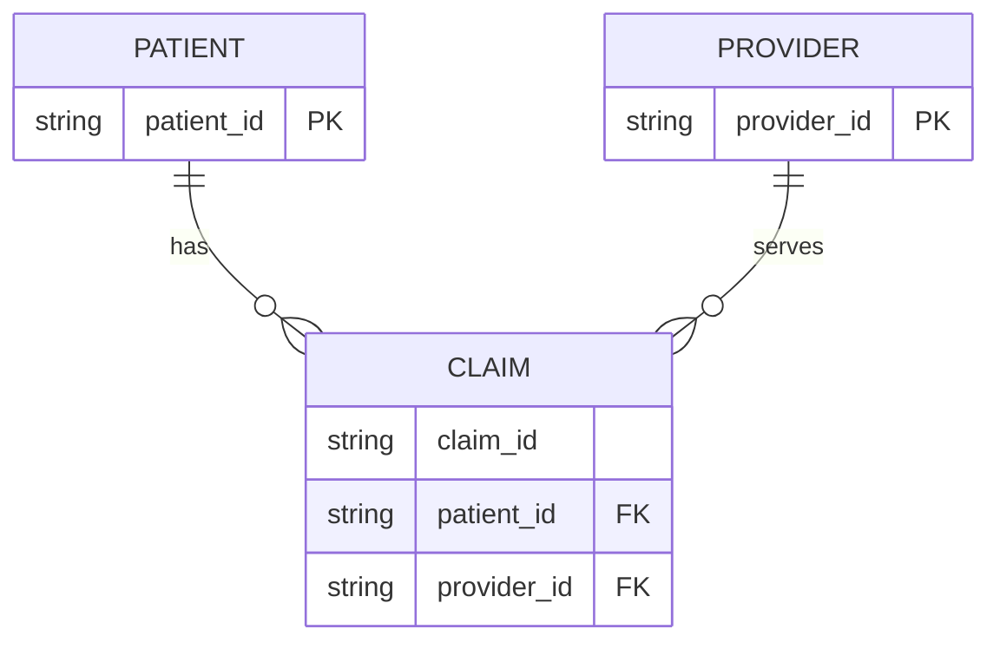

# Specification: Claims Data Quality Validator

**Version:** 1.1.0
**Date:** 2026-04-13
**Status:** In Review
**Owner:** Data Platform Team

This specification defines a Databricks-based claims validation system that checks row-level and dataset-level data quality rules before downstream processing.

## 1. Context

### 1.1 Problem Statement

Claims data can contain invalid values, broken references, and duplicates. If these issues are not detected early, they can cause incorrect payouts, reporting errors, and expensive downstream cleanup.

### 1.2 Background

Claims are already stored in Databricks tables under the `workspace.demo` schema. The validator runs against existing tables and does not redesign source schemas.

### 1.3 Business Value

- Reduce invalid claims passed to downstream workflows.
- Improve trust in BI and financial reporting datasets.
- Standardize validation output for pipeline automation.

### 1.4 User Stories

- As a data engineer, I want deterministic validation rules so I can automate quality checks in jobs.
- As a BI engineer, I want clear machine-readable errors so I can trace and fix data quality issues.
- As a platform owner, I want extensible rule registration so I can add rules without rewriting the engine.

## 2. Scope

### 2.1 In Scope

- Row-level claim validation.
- Dataset-level duplicate detection.
- Referential integrity checks for patient and provider IDs.
- JSON error output written to DBFS.
- Script execution from hardcoded Databricks tables.

### 2.2 Out of Scope (Non-Goals)

- Real-time/streaming validation.
- Fraud scoring models.
- UI/dashboard development.
- Payment processing.
- HIPAA-specific compliance controls in MVP (deferred).

## 3. Requirements

### 3.1 Functional Requirements

| ID | Requirement | Acceptance Criteria | Priority |
|----|-------------|---------------------|----------|
| FR-1 | Validate each claim row | For each claim in `workspace.demo.claims`, engine evaluates all row rules and emits zero or more violations with `claim_id` context. | Must Have |
| FR-2 | Validate dataset-level uniqueness | If a `claim_id` appears more than once in the input batch, each duplicate occurrence produces a `CONFLICT_DUPLICATE_CLAIM_ID` violation. | Must Have |
| FR-3 | Validate amount rule | `amount >= 0` passes; `amount < 0` emits `VALIDATION_NEGATIVE_AMOUNT`. | Must Have |
| FR-4 | Validate date ordering | `claim_date <= submitted_date` passes; otherwise emit `VALIDATION_INVALID_DATE_ORDER`. No future-date check in MVP. | Must Have |
| FR-5 | Validate referential integrity | `patient_id` must exist in `workspace.demo.patients` and `provider_id` must exist in `workspace.demo.providers`; missing references emit not-found violations. | Must Have |
| FR-6 | Produce JSON report in DBFS | Validation output is written as JSON to `/dbfs/tmp/validation_report.json` by default and includes all violations for the run. | Must Have |
| FR-7 | Support extensible rules | Rule registry supports adding new row or dataset rules without changing engine orchestration logic. | Should Have |

### 3.2 Non-Functional Requirements

- Performance:
   - Handle datasets up to 5 million claims per batch on Databricks cluster profiles used by the team.
   - Validation run should complete within 20 minutes for 5 million claims under baseline cluster sizing.
- Scalability:
   - Must run using PySpark in distributed Databricks environments.
- Reliability:
   - Deterministic results for identical inputs and reference tables.
- Security:
   - No raw PII values in logs.
   - No secrets in source code.
   - HIPAA controls are out of MVP scope and tracked as a future phase item.
- Maintainability:
   - Unit/integration coverage >= 80% for validation modules.
   - Rule registration pattern documented and testable.

## 4. Behavior Specification

### 4.1 Success Scenarios

#### Scenario: Valid claim passes all checks

Given: A claim with non-negative amount, valid date order, unique claim ID, existing patient ID, and existing provider ID.
When: The validation engine processes the claim batch.
Then: No violation is emitted for that claim.

#### Scenario: Batch with mixed validity

Given: A batch containing valid and invalid claims.
When: Validation runs end-to-end.
Then: Only invalid claims produce violations and all violations include code, message, and claim context.

### 4.2 Edge Cases and Error Scenarios

| Input / Condition | Expected Behavior | Test Case |
|-------------------|-------------------|-----------|
| `amount = -0.01` | Emit `VALIDATION_NEGATIVE_AMOUNT`. | `test_negative_amount_rejected()` |
| `amount = 0` | Pass amount rule. | `test_zero_amount_allowed()` |
| `claim_date > submitted_date` | Emit `VALIDATION_INVALID_DATE_ORDER`. | `test_claim_date_after_submitted_date_rejected()` |
| Duplicate `claim_id` in batch | Emit `CONFLICT_DUPLICATE_CLAIM_ID` for duplicate records. | `test_duplicate_claim_id_detected()` |
| Unknown `patient_id` | Emit `NOT_FOUND_PATIENT`. | `test_missing_patient_reference_detected()` |
| Unknown `provider_id` | Emit `NOT_FOUND_PROVIDER`. | `test_missing_provider_reference_detected()` |
| Missing required field | Emit `VALIDATION_MISSING_FIELD`. | `test_required_field_missing_detected()` |
| Null `claim_id` | Emit `VALIDATION_INVALID_CLAIM_ID`. | `test_null_claim_id_rejected()` |

## 5. Technical Stack

| Component | Technology | Version |
|-----------|-----------|---------|
| Language | Python | 3.11 |
| Processing | PySpark | 3.5 |
| Runtime | Databricks Runtime | 14.3 LTS |
| SQL | Spark SQL | 3.5 |
| Testing | pytest | 8.x |
| Build/deps | pyproject + requirements | current repository baseline |

## 6. Architecture

### 6.1 Overview

The system uses a layered validation architecture:
- Row rules for single-record checks.
- Dataset rules for cross-record constraints.
- Reporting layer for standardized JSON output.

### 6.2 Components

| Component | Responsibility |
|-----------|---------------|
| Validation engine | Executes row and dataset rules and aggregates violations. |
| Rule registry | Supplies active row and dataset rules. |
| Reference loaders | Read patient/provider reference keys from Databricks tables. |
| Reporting module | Transforms violations into JSON output schema. |
| Runner script | Orchestrates Spark reads, validation execution, and DBFS write. |

### 6.3 Component Diagram

```mermaid
graph TD
      A[workspace.demo.claims] --> E[Runner Script]
      B[workspace.demo.patients] --> E
      C[workspace.demo.providers] --> E
      E --> F[Validation Engine]
      D[Rule Registry] --> F
      F --> G[Reporting Module]
      G --> H[/dbfs/tmp/validation_report.json]
```

### 6.4 Data Flow

1. Load claims and reference IDs from Databricks tables.
2. Convert records into validation input structures.
3. Execute row and dataset rule sets.
4. Aggregate violations into error objects.
5. Write JSON report to DBFS default path.

### 6.5 Key Decisions (ADRs)

| Decision | Rationale | Alternatives Considered |
|----------|-----------|------------------------|
| Keep rule-based Python engine | Extensible and testable business logic. | Pure SQL-only validation |
| Keep dataset checks as dedicated rule layer | Clear separation from row checks and easier diagnostics. | Mixing all logic into one pass |
| Use DBFS JSON as default sink | Easy consumption by jobs, notebooks, and downstream tooling. | Databricks table as default |

## 7. Data Model

### 7.1 Entities

#### Claim

| Field | Type | Constraints | Default | Description |
|-------|------|-------------|---------|-------------|
| claim_id | string | NOT NULL, unique in batch | none | Claim identifier |
| patient_id | string | NOT NULL, FK to patients | none | Patient reference |
| provider_id | string | NOT NULL, FK to providers | none | Provider reference |
| treatment_code | string | NOT NULL | none | Procedure code |
| amount | double | >= 0 | none | Claimed amount |
| claim_date | date | NOT NULL | none | Date of service |
| submitted_date | date | NOT NULL, >= claim_date | none | Submission date |
| status | string | NOT NULL | none | Claim lifecycle status |

Relationships: Many claims to one patient; many claims to one provider.
Indexes: `claim_id` for duplicate detection acceleration.
Validation rules: See FR-2 through FR-5.

#### Patient

| Field | Type | Constraints | Default | Description |
|-------|------|-------------|---------|-------------|
| patient_id | string | PRIMARY KEY, NOT NULL | none | Patient identifier |
| birth_date | date | nullable | none | Birth date |
| insurance_type | string | nullable | none | Insurance category |

#### Provider

| Field | Type | Constraints | Default | Description |
|-------|------|-------------|---------|-------------|
| provider_id | string | PRIMARY KEY, NOT NULL | none | Provider identifier |
| provider_type | string | nullable | none | Provider category |

### 7.2 Entity Relationship Diagram



## 8. Interface Contract

### 8.1 Interface Type

- [x] CLI (script execution in Databricks job/notebook)
- [x] Library / SDK (engine callable from Python)
- [ ] REST API
- [ ] Web Application (Frontend)
- [ ] GraphQL API

### 8.2 Interface Specifications

#### CLI Command

`python scripts/run_claims_validation_from_tables.py`

- Description: Runs validation from hardcoded Databricks tables and writes JSON report to DBFS.
- Arguments: none (MVP hardcoded sources and sink).
- Exit codes: `0` success, `1` validation execution failure.

#### Library Entry Point

`ValidationEngine.validate_claims(claims, patient_ids, provider_ids) -> list[ValidationError]`

- Input constraints:
   - `claims`: list of claim dictionaries matching Claim schema.
   - `patient_ids`: set of known patient IDs.
   - `provider_ids`: set of known provider IDs.
- Output: list of structured violation objects.

## 9. Error Handling Contract

### 9.1 Error Response Format

```json
{
   "error": {
      "code": "VALIDATION_NEGATIVE_AMOUNT",
      "message": "Claim amount must be non-negative.",
      "details": {
         "claim_id": "C123",
         "field": "amount",
         "value": -12.5
      },
      "request_id": "validation-run-uuid"
   }
}
```

### 9.2 Error Code Categories

| Category | Code Pattern | Description |
|----------|-------------|-------------|
| Validation | `VALIDATION_*` | Field-level and rule-level validation failures |
| Not Found | `NOT_FOUND_*` | Missing patient/provider references |
| Conflict | `CONFLICT_*` | Duplicate claims and state conflicts |
| Server | `SERVER_*` | Unexpected internal execution failures |

### 9.3 Error Principles

- Use stable, machine-readable error codes.
- Messages must be clear and non-sensitive.
- Do not log raw sensitive fields beyond required claim identifiers.

## 10. Implementation Constraints

### 10.1 Code Quality

- [ ] Linting passes for repository standards.
- [ ] Public functions in validation modules include docstrings.
- [ ] No hardcoded secrets.

### 10.2 Testing

- [ ] Unit tests cover all FR-2 through FR-6 rule outcomes.
- [ ] Integration test validates end-to-end script execution path.
- [ ] Coverage for validation modules is >= 80%.

### 10.3 Security

- [ ] Inputs validated before rule evaluation where required.
- [ ] Logs exclude unnecessary sensitive values.
- [ ] Access to source/output tables and DBFS path follows workspace permissions.

### 10.4 Version Control

- Conventional commit format for spec and implementation changes.
- Keep rule additions and engine changes in focused commits.

## 11. Test Cases

### 11.1 Unit Tests

- `test_negative_amount_rejected()`
- `test_zero_amount_allowed()`
- `test_claim_date_after_submitted_date_rejected()`
- `test_duplicate_claim_id_detected()`
- `test_missing_patient_reference_detected()`
- `test_missing_provider_reference_detected()`
- `test_required_field_missing_detected()`

### 11.2 Integration Tests

- `test_run_claims_validation_from_tables_writes_dbfs_json()`
- `test_validation_output_schema_matches_error_contract()`

### 11.3 Performance Tests

- `test_validation_batch_5m_claims_within_20_minutes_baseline_cluster()`

## 12. Success Criteria

- [ ] FR-1 through FR-6 implemented.
- [ ] Core edge-case tests pass.
- [ ] Output JSON schema matches Section 9 contract.
- [ ] Coverage threshold met.
- [ ] Script runs in Databricks with hardcoded source tables and default DBFS output.

## 13. Invariants

- `claim_id` is unique within each validated batch.
- `amount` is never negative.
- `claim_date` is not after `submitted_date`.
- Claims must reference existing patient and provider IDs.

## 14. Risks and Open Questions

### 14.1 Risks

| Risk | Likelihood | Impact | Mitigation |
|------|-----------|--------|------------|
| Rule semantics drift across teams | Medium | High | Keep contract in spec and enforce through tests |
| Performance degradation on large batches | Medium | High | Add baseline performance test and monitor runtime |
| Incomplete reference data snapshots | Medium | Medium | Validate reference load counts and fail fast |

### 14.2 Open Questions

- Should optional output paths be introduced after MVP while keeping DBFS default?
- What retention policy should apply to DBFS validation reports?
- When should HIPAA-specific controls move from deferred to required?

## 15. References

- [Specification template](../spec.template.md)
- [Development workflow](../DEVELOPMENT.md)
- [ADR-001: monolithic backend architecture](../adr/ADR-001-monolithic-backend-architecture.md)
- [ADR-002: async I/O by default](../adr/ADR-002-async-io-by-default.md)

## Appendix: Validation Checklist

- [x] Functional requirements have measurable acceptance criteria.
- [x] Core behavior scenarios and edge cases are specified.
- [x] Interface and error contracts are defined.
- [x] Test cases are listed for TDD implementation start.
- [x] Scope boundaries and deferred items are explicit.
#### demo.providers

| Column        | Type   | Description |
|---------------|--------|-------------|
| provider_id   | string | Unique provider identifier |
| provider_type | string | Provider type/category |

#### demo.claims

| Column          | Type   | Description |
|-----------------|--------|-------------|
| claim_id        | string | Unique claim identifier |
| patient_id      | string | Foreign key to patient |
| provider_id     | string | Foreign key to provider |
| treatment_code  | string | Procedure or treatment code |
| amount          | double | Claimed amount |
| claim_date      | date   | Date of service |
| submitted_date  | date   | Submission date |
| status          | string | Claim lifecycle status |

*See Databricks Catalog Explorer for authoritative schema and sample data.*
# Specification: Claims Data Quality Validator

---

## 1. Project Overview

This project aims to build a **data quality validation system** for healthcare insurance claims.

The system is intended to validate enterprise data already stored in Databricks schemas,
including existing tables such as `demo.claims`, `demo.patients`, and `demo.providers`.

The system validates incoming claims data against:
- Structural rules
- Business rules
- Data integrity constraints

The goal is to **detect invalid, suspicious, or inconsistent claims early** before downstream processing (approval, payment, analytics).

This system is designed for use in a **data platform environment (Azure / Databricks / dbt)** and supports both batch and scalable processing.

---

## 2. Objectives

### Business Goals
- Prevent incorrect claim payouts
- Improve data quality for analytics and reporting
- Detect anomalies and potential fraud patterns early

### Technical Goals
Provide a Python script (`scripts/run_claims_validation_from_tables.py`) that reads claims and patient data directly from hardcoded Databricks tables (e.g., `workspace.demo.claims`, `workspace.demo.patients`) using Spark, and runs the validation logic in memory. The script must not require file-based input.

---

## 3. Target Users

### Primary Users
- Data Engineers (Databricks / PySpark / dbt)
- BI Engineers (SQL / Power BI)

### Expectations
- Clear validation output (what is wrong and why)
- Easy integration into pipelines
- Scalable to large datasets
- Transparent and explainable rules

---

## 4. Scope

### In Scope
  - Duplicate claims
  - Invalid amounts
  - Invalid dates
  - Referential integrity issues
  - Business rule violations

### Out of Scope (Non-Goals)
- Real-time streaming validation
- Full fraud detection system
- UI/dashboard development
- Payment processing
- Re-designing or replacing existing enterprise Databricks schemas

---

## 5. Functional Requirements

The system must:

1. Validate claim records individually
2. Validate dataset-level constraints (e.g. duplicates)
3. Produce a list of validation errors per claim
4. Support multiple validation rules:
   - Amount must be > 0
   - Claim date cannot be in the future
   - Submitted date must be >= claim date
   - Claim IDs must be unique
   - Patient must exist
5. Support extensible rule definitions

---

## 6. Non-Functional Requirements (NFRs)

- **Performance**: Handle datasets up to millions of records (via PySpark)
- **Scalability**: Must work in distributed environment (Databricks)
- **Maintainability**: Rules must be easy to extend
- **Observability**: Clear logging of validation results
- **Reliability**: Deterministic validation results
- **Security**: No exposure of sensitive data in logs

---

## 7. Data & Domain Model

### Entities

#### Claim
- claim_id (string)
- patient_id (string)
- provider_id (string)
- treatment_code (string)
- amount (float)
- claim_date (date)
- submitted_date (date)
- status (string)

#### Patient
- patient_id (string)
- birth_date (date)
- insurance_type (string)

#### Provider
- provider_id (string)
- provider_type (string)

---

### Databricks Table Schemas

#### demo.patients

| Column          | Type   | Description |
|-----------------|--------|-------------|
| patient_id      | string | Unique patient identifier |
| birth_date      | date   | Patient birth date |
| insurance_type  | string | Insurance policy classification |

*See Databricks Catalog Explorer for authoritative schema and sample data.*

---

## 8. Technical Architecture

### Components

1. **Validation Engine (Python)**
   - Applies rule-based validation per record

2. **SQL Validation Layer**
   - Dataset-level checks (duplicates, joins)

3. **PySpark Layer**
   - Scalable validation for large datasets

### Interaction

- Data loaded from existing Databricks tables and schemas
- Primary enterprise integration target includes schema tables such as `demo.claims` and
   `demo.patients`
- Validation rules applied
- Output stored or returned as error report

---

## 9. Deployment Architecture

- Runs in Azure Databricks environment
- Python validation runs as notebook or job
- SQL checks executed in Databricks SQL or dbt

spark = SparkSession.builder.getOrCreate()
### Databricks Execution & Usage

The validator must be runnable as a Python script (`scripts/run_claims_validation_from_tables.py`) in the Databricks environment, with all table and schema names hardcoded for the workspace `https://dbc-a070d6b0-c1c0.cloud.databricks.com` and schema `demo`.

**Execution contract:**
- The script reads claims from `workspace.demo.claims` and patients from `workspace.demo.patients` using Spark DataFrame APIs.
- No file-based input is required or supported for the main validation flow.
- The script runs the validation logic in memory and writes the output (validation errors) to a new or existing Databricks table (e.g., `workspace.demo.validation_report`) or to DBFS as a JSON file.

**Example usage:**

```python
from pyspark.sql import SparkSession
from claims_validation.engine import ValidationEngine
from claims_validation.reporting import build_error_report
from claims_validation.rules.registry import default_registry

spark = SparkSession.builder.getOrCreate()
claims_df = spark.table("workspace.demo.claims")
patients_df = spark.table("workspace.demo.patients")
claims = [row.asDict(recursive=True) for row in claims_df.collect()]
patient_ids = {str(row["patient_id"]) for row in patients_df.select("patient_id").collect()}

engine = ValidationEngine(
    row_rules=default_registry().row_rules(),
    dataset_rules=default_registry().dataset_rules(),
)
errors = engine.validate_claims(claims, patient_ids)
report = build_error_report(errors)

# Write to Databricks table or DBFS
report_df = spark.createDataFrame(report)
report_df.write.mode("overwrite").saveAsTable("workspace.demo.validation_report")
# or
# with open("/dbfs/tmp/validation_report.json", "w") as f:
#     import json; json.dump(report, f, indent=2)
```

**How to run:**
1. Submit the script as a Databricks job or run in a Databricks notebook cell.
2. Ensure the cluster has access to the `demo` schema and required Python dependencies.
3. Output will be available in the specified Databricks table or DBFS path.

**Dependencies and setup:**
- `databricks.yml` defines workspace and target metadata.
- Use the Databricks VS Code extension/workflow for workspace authentication and development.
- All table/schema/workspace names are hardcoded for demo/enterprise reproducibility.

---

## 10. Technology Stack

- Python
- PySpark
- SQL
- Databricks
- Azure Data Platform

---

## 11. Architecture Patterns

- Layered validation:
  - Row-level validation (Python)
  - Dataset-level validation (SQL)
- Rule-based validation engine
- Separation of concerns between data processing and validation

---

## 12. CI/CD Requirements

- Unit tests must pass before deployment
- Validation logic must be version-controlled
- Automated test execution (pytest)

---

## 13. Invariants

These rules must NEVER be violated:

- Claim amount must be non-negative
- Claim must reference a valid patient
- Claim IDs must be unique
- Dates must follow logical order

---

## 14. ADRs (Architecture Decision Records)

### ADR-001: Use Python for validation logic
- **Decision**: Use Python for core validation
- **Context**: Flexible and easy to extend
- **Alternative**: Pure SQL
- **Consequence**: Requires integration with Spark

### ADR-002: Use SQL for dataset validation
- **Decision**: Use SQL for aggregation checks
- **Context**: Efficient for duplicates and joins
- **Consequence**: Split logic across layers

---

## 15. Phases

### MVP
- Basic validation rules
- Python validator
- SQL queries

### Phase 1
- Extend rule set
- Add PySpark support

### Phase 2
- Integration into pipelines
- Monitoring and logging

---

## 16. Acceptance Criteria

- Validator detects all injected data issues
- Tests validate all rules
- SQL queries correctly identify duplicates and invalid references
- Output clearly explains validation failures

---

## 17. Success Metrics

- % of invalid records detected
- Reduction in downstream data errors
- Developer adoption of validation framework

---

## 18. Risks & Trade-offs

### Risks
- Incomplete rule coverage
- Performance issues on large datasets
- Misinterpretation of business rules

### Trade-offs
- Python flexibility vs SQL performance
- Simplicity vs completeness

---

## 19. Open Questions

- Should validation results be stored or only logged?
- How should rules be configured (code vs config)?
- How to integrate with dbt models?
